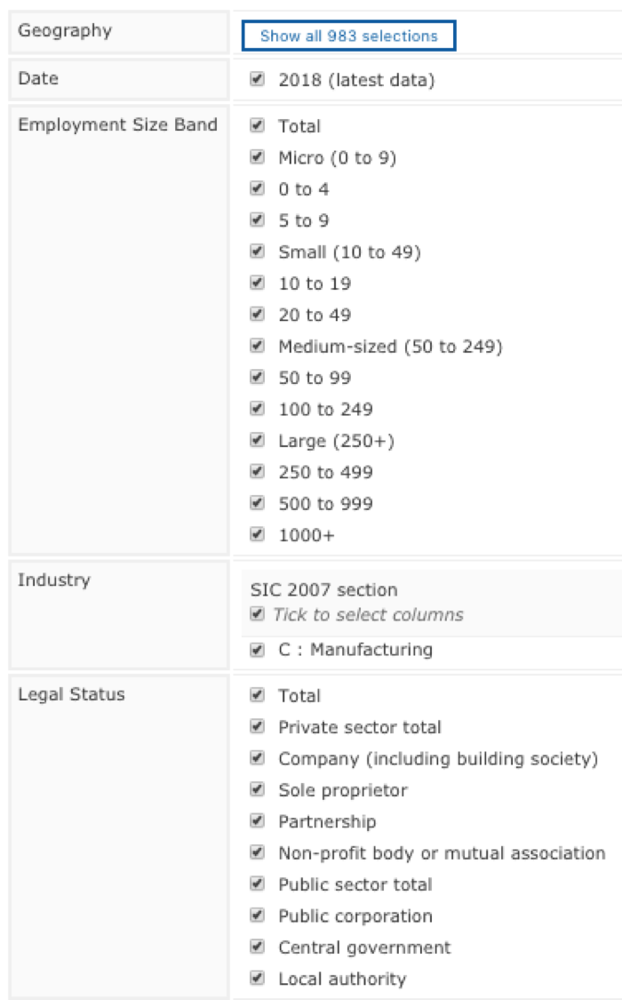
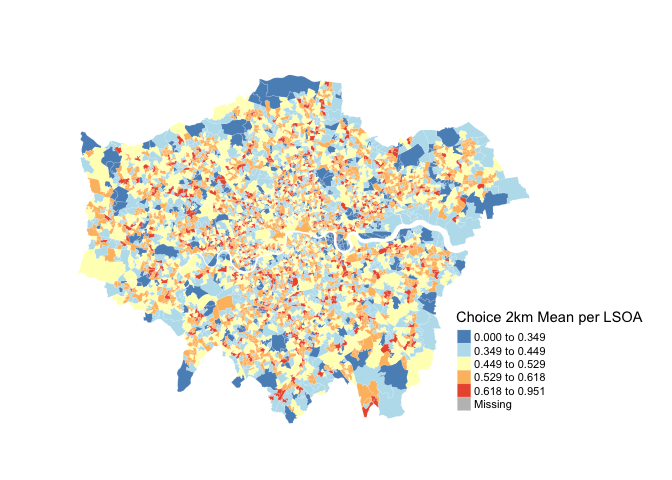
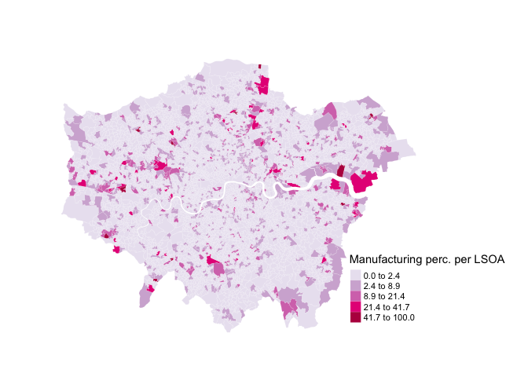
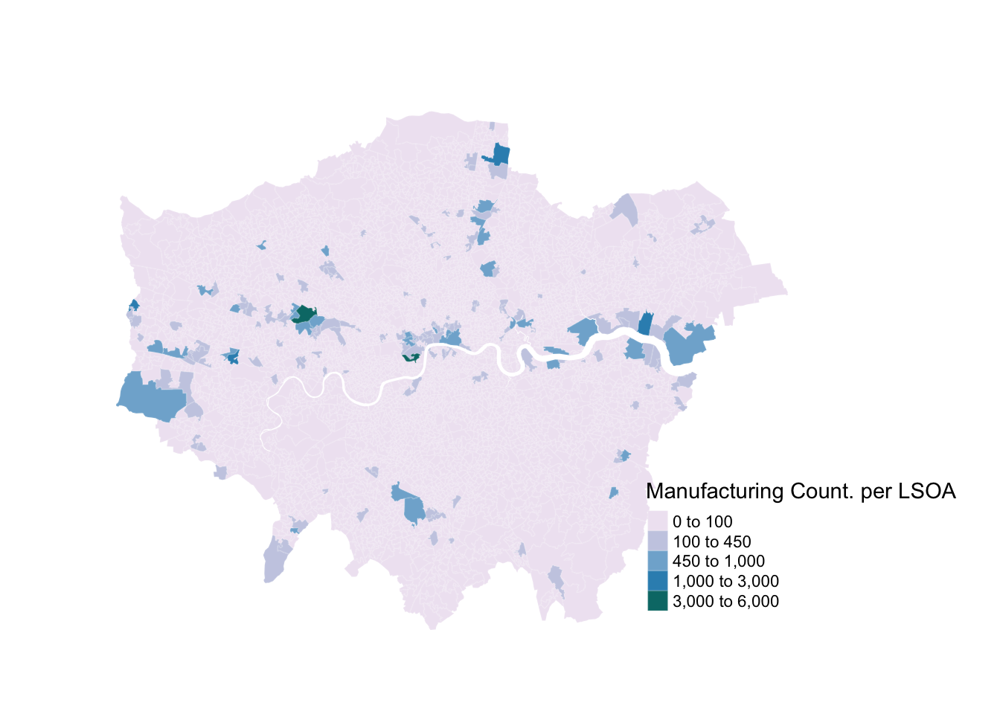

<style>
  h1, h2, h3, h4, h5, h6{
    color: #668e81;
    font-family: "arial narrow", helvetica;
  }
  h1, h2{
    font-size: 150%
  }
  h2{
    font-variant: small-caps
  }
</style>

```{r setup, include=FALSE}
knitr::opts_chunk$set(echo = TRUE)
```

# Map of local units by industry

***
Reference URLs

https://www.nomisweb.co.uk/query/construct/summary.asp?mode=construct&version=0&dataset=141 
http://geoportal.statistics.gov.uk/datasets/826dc85fb600440889480f4d9dbb1a24_3?geometry=-7.878%2C50.796%2C6.031%2C53.163  
http://zevross.com/blog/2018/10/02/creating-beautiful-demographic-maps-in-r-with-the-tidycensus-and-tmap-packages/  

***

*"An extract compiled from the Inter Departmental Business Register (IDBR) recording the number of local units that were live at a reference date in March. Estimates can be broken down by employment size band, detailed industry (5 digit SIC2007) and legal status. Available from country down to mid layer super output area and Scottish intermediate zones"*

**libraries**
```{r, message=FALSE, warning=FALSE}
library(dplyr)
library(readr)
library(maptools)
library(RColorBrewer)
library(classInt)
#library(OpenStreetMap)
library(sp)
library(rgeos)
library(tmap)
library(tmaptools)
library(sf)
library(rgdal)
library(geojsonio)
library(ggplot2)
library(spData)
library(tidyverse)
```

## prepare dataset

Read from MSOA data from London Atlas (statistical-gis-boundaries-london)
```{r, message=FALSE, warning=FALSE}
msoa <- st_read("/Volumes/ritd-ag-project-rd00lq-jamfe87/GIS_Analysis/dataRaw/statistical-gis-boundaries-london/ESRI/MSOA_2011_London_gen_MHW.shp")
```

Get vector of MSOA codes
```{r}
msoa_cd <- msoa[,1]
msoa_cd <- st_set_geometry(msoa_cd, NULL)
msoa_cd <- as.vector(msoa_cd$MSOA11CD, mode = 'any') # 983 obs.
msoa_cd

```

Write csv
```{r}
write.csv(msoa_cd, file = "/Volumes/ritd-ag-project-rd00lq-jamfe87/GIS_Analysis/dataProcessed/msoa_codes.csv")
```

Quick map
```{r}
qtm(msoa)
```

load Nomis data 'UK Business Counts - local units by industry and employment size band'  
Query summary  
```{r, out.width = "300px", echo=FALSE}

```

Read MSOA csv
```{r}
msoaC <- read_csv("/Volumes/ritd-ag-project-rd00lq-jamfe87/GIS_Analysis/dataProcessed/msoa_nomis_counts.csv")
```

Join datasets
```{r}
names(msoa)
head(msoa)
```

```{r}
head(msoaC)
```

```{r}
join1 <- append_data(msoa, msoaC, key.shp = "MSOA11CD", key.data = "mnemonic", ignore.duplicates = TRUE, ignore.na = TRUE)
```

Quick map
```{r}
Count <- tm_shape(join1) +
  tm_polygons("Total",
              style="jenks",
              palette="BuPu",
              title="Manufacturing Count per MSOA",
              border.col="white",
              border.alpha = 0.1) +
  tm_layout(inner.margins = c(0, 0.1, 0.05, 0.2), frame = F) # b, l, t, r 
Count
```
  
Quick 'spatial data classification method' comparison
URLs: https://geocompr.robinlovelace.net/adv-map.html  

```{r}
Comp <- tm_shape(join1) +
  tm_polygons(c("Total","Total","Total","Total"),
              style=c("jenks","pretty", "equal", "quantile"),
              palette="BuPu",
              title=c("Jenks", "Pretty", "Equal", "Quantile"),
              border.col="white",
              border.alpha = 0.1) +
  tm_layout(inner.margins = c(0, 0.1, 0.05, 0.2), frame = F) +
  tm_legend(legend.position = c("right", "bottom"),
          main.title = "Manufacturing \nCount per MSOA \nCompare Class.",
          main.title.position = "right",
          main.title.size=0.9)
  tm_layout(inner.margins = c(0, 0.1, 0.05, 0.2), frame = F) # b, l, t, r 
Comp
```
  
style = jenks identifies groups of similar values in the data and maximizes the differences between categories.

Load 'UK Business Counts - enterprises by industry and employment size band'  
C : Manufacturing  
G : Wholesale and retail trade; repair of motor vehicles and motorcycles  
I : Accommodation and food service activities  

```{r}
msoaCI <- read_csv("/Volumes/ritd-ag-project-rd00lq-jamfe87/GIS_Analysis/dataProcessed/msoa_nomis_counts_ind.csv")
```

Join to MSOAs
```{r}
join2 <- append_data(join1, msoaCI, key.shp = "MSOA11CD", key.data = "cd", ignore.duplicates = TRUE, ignore.na = TRUE)
```
```{r}
names(join2)
```


Map of:  
UK Business Counts - local units by industry and employment size band (1 ind - Manufacturing)  
UK Business Counts - enterprises by industry and employment size band (3 industries - Man, Ret, Food)
```{r}
suma <- tm_shape(join2) +
    tm_polygons(c("Total",
                  "C : Manufacturing",
                  "G : Wholesale and retail trade; repair of motor vehicles and motorcycles",
                  "I : Accommodation and food service activities"), 
        style="jenks",
        palette="PuRd",
        auto.palette.mapping=FALSE,
        title=c("Local Units \nManufacturing",
                "Enterprises \nManufacturing",
                "Enterprises Retail",
                "Enterprises \nFood Service"),
        border.col="white",
        border.alpha = 0.1) +
  tm_layout(inner.margins = c(0, 0.1, 0.05, 0.2), frame = F) +
  tm_legend(legend.position = c("right", "bottom"),
          main.title = "Count per MSOA",
          main.title.position = "right",
          main.title.size=0.9)
suma
```
  
**UK Business Counts - local units by industry and employment size band**
*An extract compiled from the Inter Departmental Business Register (IDBR) recording the number of Local Units that were live at a reference date in March, broken down by employment size band, detailed industry (5 digit SIC2007) and legal status. Local Units are individual sites that belong to an Enterprise. Available from country down to mid layer super output area and Scottish intermediate zones.*

**UK Business Counts - enterprises by industry and employment size band**
*An extract compiled from the Inter Departmental Business Register (IDBR) recording the number of Enterprises that were live at a reference date in March, broken down by employment size band, detailed industry (5 digit SIC2007) and legal status. An Enterprise is the smallest combination of legal units which has a certain degree of autonomy within an Enterprise Group. Available from country down to mid layer super output area and Scottish intermediate zones.*

## summary of previous analysis

Choice 2km
```{r, out.width = "1000px", echo=FALSE}

```

**Percentage Manufacturing** Business Register and Employment Survey : open access
```{r, out.width = "1000px", echo=FALSE}

```

**Count Manufacturing** Business Register and Employment Survey : open access
```{r, out.width = "900px", echo=FALSE}

```

