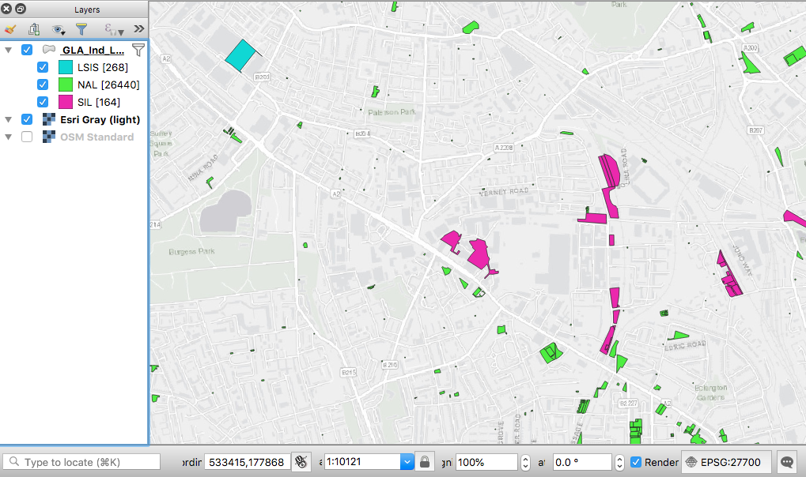

<style>
* {
  font-family: "Palatino"
}

h1{
    font-size: 190%
}

h2{
    font-size: 160%
}

h3{
    font-size: 150%
}

h4{
    font-size: 130%
}

h5{
    font-size: 110%
}

h6{
    font-size: 90%
}
table {
  width: 100%;
}
</style>

*libraries*
```{r message=FALSE, warning=FALSE, paged.print=FALSE}
library(ggplot2)
library(ggthemes)
library(gridExtra)
library(knitr)
library(htmlTable)
library(readr)
library(sp)
library(rgeos)
library(tmap)
library(tmaptools)
library(sf)
library(rgdal)
library(geojsonio)
library(spData)
library(tidyverse)
library(maptools)
library(RColorBrewer)
library(plyr)
#install.packages("reshape")
library(reshape)
library(classInt)
#install.packages("BAMMtools")
library(BAMMtools)
#install.packages("psych")
library(psych)
library(data.table)
```

# Problem
Identify locations outside the Industrial Land Designation areas with high concentration of manufacturing, other economic activities and residences.

# Context

We have analysed 3 open data datasets refering to Manufacturing in London.  

```{r include=FALSE}
Name <- c('Directory of London Businesses - UK Standard Industrial Classification (SIC)','Business Register and Employment Survey - BRES','Inter Departmental Business Register (IDBR)')
Source <- c('London Data Store (1)','NOMIS - Official Labour Market Statistics ONS (2)','NOMIS - Official Labour Market Statistics ONS')
Observation <- c('“Data snapshot containing basic company data of live companies on the register. Each entry represents a financial accounts submission of either a whole company or part of one. Some businesses have more than one entry in the directory because they need to submit more than one set of accounts for different parts of their business.” “The London cut available to download here, was created using a postcode list… inaccuracies in postcodes may mean that no local authority is listed for a company.”','“An employer survey of the number of jobs held by employees broken down by full/part-time and detailed industry (5 digit SIC2007)”','“An extract recording the number of local units that were live at a reference date in March. Estimates can be broken down by employment size band, detailed industry (5 digit SIC2007) and legal status.” - “A local unit is an individual site (for example a factory or shop) associated with an enterprise. It can also be referred to as a workplace.”')
General_Desc <- c('Point data, N = 1,130,474 obs.','Estimated number of jobs per LSOA (N = 4,835 obs.) Includes Industry percentage (percentage of jobs in Manufacturing) (3)','Number of workplaces per MSOA (N = 983 obs.) (4)')
Version <- c('May 2018','2017 (latest data)','2018 (latest data)')
```

```{r include=FALSE}
sT <- data.frame(Name, Source, Observation, General_Desc, Version)
htmlTable(sT, rnames=F, align="l", col.columns = c("none", "#F7F7F7"), css.cell="padding:1em")
```

URLs:  
1 https://data.london.gov.uk   
2 https://www.nomisweb.co.uk/  
3 https://www.ons.gov.uk/employmentandlabourmarket/peopleinwork/employmentandemployeetypes/bulletins/businessregisterandemploymentsurveybresprovisionalresults/provisionalresults2017revisedresults2016#quality-and-methodology  
4 https://www.ons.gov.uk/aboutus/whatwedo/paidservices/interdepartmentalbusinessregisteridbr https://www.ons.gov.uk/businessindustryandtrade/business/activitysizeandlocation/methodologies/ukbusinessactivitysizeandlocationqmi  

# Cartographic summary


# Analysis

A detailed analysis was carried out for the BRES dataset due to four reasons:  

1. The number of manufacturing jobs obtained from the BRES dataset is considered the best proxy to represent manufacturing intensity. This measure can be interpreted as a combination of number of manufacturing units and size.  

2. The level of detail of the BRES dataset at the LSOA area is considered sufficient to allow the selection of case study areas for micro-morphology analysis.  

3. The SIC dataset despite having a finer-grain resolution has shown innacuracies in the location of the data points (reference: Vyner street case study Cites of Making project).  

4. Despite the fact that the IDBR considers a larger sample at the national level, it is aggregated at a lower resolution geographic area (MSOA). Also, because according to a data methodological note "it is possible to get multiple business registrations at a single address and this can distort data for smaller geographical areas" (https://www.ons.gov.uk/businessindustryandtrade/business/activitysizeandlocation/methodologies/ukbusinessactivitysizeandlocationqmi/pdf).  

## Metadata
Data source: NOMIS official labour market statistics (ONS)
URL: https://www.nomisweb.co.uk/  
Definition: *"An employer survey of the number of jobs held by employees broken down by full/part-time and detailed industry (5 digit SIC2007). The survey records a job at the location of an employees workplace. Available from country down to lower level super output area and Scottish datazone."*  
Ref URLs: https://onsdigital.github.io/dp-classification-tools/standard-industrial-classification/ONS_SIC_hierarchy_view.html  

Read NOMIS data. Lower Layer Super Output Area (2011)  
Industry Standard industrial classification of economic activities (SIC) 2007 section C: Manufacturing
```{r message=FALSE, warning=FALSE}
nom <- read_csv("/Volumes/ritd-ag-project-rd00lq-jamfe87/GIS_Analysis/dataProcessed/nomis_4835.csv") # 4,835 obs.
```

## Data summary
Create variable 'lsoa11_cd' from variable 'lsoa11_2011' substract chr 1 to 4 (first 4 characters)
```{r, message=FALSE, warning=FALSE}
nom <- mutate(nom, lsoa11_cd = substr(lsoa_2011, 1, 9))
```

Summary of 'nom' Count and Industry percentage
```{r}
summary(nom)
```

```{r}
nrow(table(nom$Count)) # [1] 34
dCount <-as.data.frame(table(nom$Count))
colnames(dCount) <-c("Jobs", "Frequency")
dCount1 <- cbind(dCount[1:10, ], dCount[11:20, ], dCount[21:30, ], dCount[31:40, ])
htmlTable(dCount1, rnames=F, caption="Jobs count frequency per LSOA (N = 4,835)", col.columns = c("none", "#F7F7F7"), css.cell="padding-left:1em; padding-right:1em;")
```
Most LSOAs have 0 jobs in manufacturing. Among the rest the most frequent number is 10 jobs (in 539 LSOAs). High number of jobs ( > 1500) are an exception. 

```{r}
table(nom[,3]) # 22 LSOA with 20% jobs in Manufacturing Industry
```

```{r}
nrow(table(nom$`Industry percentage`)) # [1] 107
dInd <-as.data.frame(table(nom$`Industry percentage`))
colnames(dInd) <-c("Perc.", "Frequency")
dInd1 <- cbind(dInd[1:22, ], dInd[23:44, ], dInd[45:66, ], dInd[67:88, ], dInd[89:110, ])
htmlTable(dInd1, rnames=F, caption="Jobs Percentage frequency per LSOA (N = 4,835)", col.columns = c("none", "#F7F7F7"), css.cell="padding-left:1em; padding-right:1em;")
```
Most LSOAs have 0% jobs in manufacturing. Among the rest the most frequent percentage is 5% (in 102 LSOAs). High percentage of jobs ( > 53%) are an exception.

## Histograms
```{r}
# drop 0 values
nom1 <- subset(nom, nom$Count > 0 & nom$`Industry percentage` > 0) # 1730
```

Summary of values > 0  
```{r}
summary(nom1)
```

```{r}
# style
th <- theme_tufte(base_family = "Georgia")

h1 <- ggplot(nom1, aes(Count)) + geom_histogram(bins = 6000/5, fill="magenta") + th + ylab("LSOAs") + xlab("Jobs count")
h2 <- ggplot(nom1, aes(Count)) + geom_histogram(bins = 150/5, fill="magenta") + th + xlim(c(0, 150)) + ylab("LSOAs") + xlab("Jobs count (0-150)")
h3 <- ggplot(nom1, aes(`Industry percentage`)) + geom_histogram(bins = 100, fill="magenta") + th + ylab("LSOAs") + xlab("% of jobs in Manufacturing")
h4 <- ggplot(nom1, aes(`Industry percentage`)) + geom_histogram(bins = 200, fill="magenta") + th + xlim(c(0, 35)) + ylab("LSOAs") + xlab("% of jobs in Manufacturing (0-35%)")
grid.arrange(h1, h2, h3, h4, nrow=2)
```

## Boxpolots
```{r}
fnC <- fivenum(nom1$Count)
fnP <- fivenum(nom1$`Industry percentage`)
```

```{r}
anC <- annotate(geom="text", label=round(fnC ,digits=2), x= 1, y=fnC, size = 3, family = "Georgia", hjust =-.2)
anP <- annotate(geom="text", label=round(fnP ,digits=2), x= 1, y=fnP, size = 3, family = "Georgia", hjust =-.2)
th <- theme(axis.title=element_blank(),axis.ticks.x = element_blank(), axis.text.x=element_blank())

bC <- ggplot(nom1, aes(1, Count)) + geom_tufteboxplot() + scale_y_log10() + theme_classic() + anC +
  ggtitle("Jobs Count (N = 1,730)") + th + theme_tufte()
bP <- ggplot(nom1, aes(1, `Industry percentage`)) + geom_tufteboxplot() + scale_y_log10() + theme_classic() + anP  + ggtitle("Jobs Percentage (N = 1,730)") + th + theme_tufte()

grid.arrange(bC, bP, nrow=1)
```

## Maps
```{r, message=FALSE, warning=FALSE}
lsoa <- st_read("/Volumes/ritd-ag-project-rd00lq-jamfe87/GIS_Analysis/dataRaw/statistical-gis-boundaries-london/ESRI/LSOA_2011_London_gen_MHW.shp")
```

Create gray London basemap
```{r echo=FALSE}
gLon <- st_read("/Volumes/ritd-ag-project-rd00lq-jamfe87/GIS_Analysis/dataRaw/statistical-gis-boundaries-london/ESRI/MSOA_2011_London_gen_MHW.shp")
gLonC <-st_combine(gLon)
qtm(gLonC, fill = "grey90", borders = NULL)
```

Join with NOMIS data 'nom'
```{r}
mpl <- append_data(lsoa, nom, key.shp = "LSOA11CD", key.data = "lsoa11_cd", ignore.duplicates = TRUE, ignore.na = TRUE)
names(mpl)
```

Maps of job Counts > 40 and Percentage > 6% (> 3rd Q)
```{r}
# change column name
colnames(mpl)[17] <- "IndPer"

c40 <- subset(mpl, Count >= 40) # 439 obs.
p6 <- subset(mpl, IndPer >= 6) # 434 obs.
# CP <- subset(mpl, Count >= 40 | IndPer >= 6)
```


```{r fig.height=6, fig.width=6, dpi=300, out.width="2000px"}
mc40 <- tm_shape(gLonC) +
  tm_fill(col = "gray95") +
  tm_shape(c40) +
    tm_polygons("Count", 
        style="jenks",
        palette="PuRd",
        title= "Count",
        border.col="white",
        border.alpha = 0.1,
        legend.hist = T) +
  tm_layout(inner.margins = c(0, 0.1, 0.05, 0.2), frame = F, 
            legend.outside = T, legend.outside.position = "bottom", legend.stack = "horizontal", legend.hist.width = 3, legend.hist.height = 0.8) +
  tm_legend(main.title = "Jobs Count > 3rd Q (N=439 obs.)",
          main.title.position = "left",
          main.title.size=0.9)
mc40
```

```{r fig.height=6, fig.width=6, dpi=300, out.width="2000px"}
mp6 <- tm_shape(gLonC) +
  tm_fill(col = "gray95") + 
  tm_shape(p6) +
    tm_polygons("IndPer", 
        style="jenks",
        palette="BuPu",
        title= "Percentage",
        border.col="white",
        border.alpha = 0.1,
        legend.hist = T) +
  tm_layout(inner.margins = c(0, 0.1, 0.05, 0.2), frame = F, 
            legend.outside = T, legend.outside.position = "bottom", legend.stack = "horizontal", legend.hist.width = 3, legend.hist.height = 0.8) +
  tm_legend(main.title = "Jobs Percentage > 3rd Q (N=434 obs.)",
          main.title.position = "left",
          main.title.size=0.9)
mp6
```

```{r}
tmap_arrange(mc40 ,mp6 , nrow=1)
```
A visual comparison shows that LSOAs with high number of jobs in some cases is coincident with LSOAs with high percentage of jobs. Both meaures might be indicators of 'manufacturing intensity'.

```{r}
msum <- tm_shape(mpl) +
  tm_polygons(col="#ffffe5", border.col="#ededed", border.alpha = 0.01) + 
  tm_shape(c40) +
  tm_polygons("Count",
              style="jenks",
              palette="BuPu",
              title="Jobs Count",
              border.col="white",
              border.alpha = 0.1,
              alpha = 0.5) + 
  tm_shape(p6) +
  tm_polygons(border.col = "magenta", 
              border.alpha = 0.5, 
              alpha = 0,
              popup.vars= c("Count" ,"IndPer")) +
  tm_layout(inner.margins = c(0, 0.1, 0.05, 0.2), frame = F) 
```

```{r fig.height=6, fig.width=10, dpi=300, out.width="2000px"}
tmap_mode("plot")
msum
```

Interactive Map
```{r}
#msum.i <- msum
#tmap_mode("view")
#msum.i
```

```{r}
#tmap_save(msum.i, "msum.html")
```


The selection of values with both conditions Count >= 40 & IndPer >= 6 shows 253 obs.
```{r fig.height=6, fig.width=6, dpi=300, out.width="2000px"}
CP <- subset(mpl, Count >= 40 & IndPer >= 6) # 253 obs.
mCP <- tm_shape(CP) +
    tm_polygons(c("Count",
                  "IndPer"), 
        style="jenks",
        palette=list("PuRd","BuPu"),
        title=c("Count",
                "Percentage"),
        border.col="white",
        border.alpha = 0.1) +
  tm_layout(inner.margins = c(0, 0.1, 0.05, 0.2), frame = F) +
  tm_legend(legend.position = c("right", "bottom"),
          main.title = "Jobs and Percentage > 3rd Q (N=253 obs.)",
          main.title.position = "center",
          main.title.size=0.9)
mCP
```

### Industrial Land 2015

```{r}
ild <- st_read("/Volumes/ritd-ag-project-rd00lq-jamfe87/GIS_Analysis/dataProcessed/GLA_Ind_Land_Baseline_2015/GLA_Ind_Land_bl_2015.shp")
```

Summary of 'ild' (n=104006 obs.)
```{r}
summary(ild)
```

Largest area is near 81 ha and 1st Qu goes from 0 to 18 sqm. (sqm to ha = divide by 10k)
Frequency by type ('TYPE_2015')  
```{r}
t5 <- count(ild, vars = "TYPE_2015")

htmlTable(t5, rnames=F, caption="Industrial Land Type", col.columns = c("none", "#F7F7F7"), css.cell="padding-left:1em; padding-right:1em;")
```

Shape area summary by Type
```{r}
library(purrr)
typeSUM <- ild %>% split(.$TYPE_2015) %>% map(summary)
```

```{r}
class(ild)
ilddf <- st_set_geometry(ild, NULL)

```

```{r}
tSu <- ilddf[, c(8,15)] %>%
  group_by(TYPE_2015) %>%
  summarise_if(
    is.numeric,
    funs(mean = mean, median = median, min = min, max = max, sd = sd) 
  )
```

```{r}
round_df <- function(x, digits) {
    # round all numeric variables
    # x: data frame 
    # digits: number of digits to round
    numeric_columns <- sapply(x, mode) == 'numeric'
    x[numeric_columns] <-  round(x[numeric_columns], digits)
    x
}

tSu <- cbind(tSu[,1], round_df(tSu[,2:5], 2))
```


```{r}
htmlTable(tSu, rnames=F, caption="Industrial Land Type", col.columns = c("none", "#F7F7F7"), css.cell="padding-left:1em; padding-right:1em;")
```

Analyse area distributuon by type
```{r}
ilddfT <- ilddf[,c(8,15)] 
tyS <- t(sapply(
  by(
    ilddfT$Shape_Area, list(ilddfT$TYPE_2015), cut, dig.lab=10,breaks=c(-Inf,5,30,100,500,5000,20000,Inf)),
  table))
tyS <- as.data.frame(tyS)
# add row with Totals
tyS <- rbind(tyS, colSums(tyS))
attr(tyS, "row.names")[4] <- "Total"
tyS

```

```{r}
htmlTable(tyS, caption="Industrial Land Type", col.columns = c("none", "#F7F7F7"), css.cell="padding-left:1em; padding-right:1em;")
```


```{r}
# faster function than ClassInt to calculate classes
jenks7 <- getJenksBreaks(ilddfT$Shape_Area, 8)

jenks7 <- round(jenks7)

tyS1 <- t(sapply(
  by(
    ilddfT$Shape_Area, list(ilddfT$TYPE_2015), cut, dig.lab=10, breaks=jenks7),
  table))
tyS1 <- as.data.frame(tyS1)

# add row with Totals
tyS1 <- rbind(tyS1, colSums(tyS1))
attr(tyS1, "row.names")[4] <- "Total"

htmlTable(tyS1, caption="Industrial Land Type", col.columns = c("none", "#F7F7F7"), css.cell="padding-left:1em; padding-right:1em;")
```

```{r}
# "URSID" = ' ' (N=26,876 obs.) 
# read from Statistical Summary for 'Shape_Area' in QGIS

noCode <- read.clipboard(header = TRUE)
noCode1 <- noCode
htmlTable(noCode1, rnames=F, caption="'Shape_Area' empty URSID", col.columns = c("none", "#F7F7F7"), css.cell="padding-left:1em; padding-right:1em;")


```

Sample of "URSID" = ' ' (N=26,876 obs.) by 'TYPE_2015'
```{r, out.width = "1000px", echo=FALSE}

```

26,640 obs. (out of N=26,876 obs.) are 'NAL' 'TYPE_2015' (see AECOM map for meaning of NAL - might be Non-designated Sites which although are part of the 'GLA-Desiganted Industrial Land' dataset). The absence of 'URSID' code might be related to being 'Non-designated Sites'. However, there're 'big' sites of 'LSIS' and 'SIL' type without URSID code. Also, there might be uncoded 'NAL' type areas that have the potential of being classified as 'LSIS' or 'SIL'. The size of the area might be a factor to consider.  
How is the size of the uncoded sites distributed according to 'TYPE_2015'?

```{r}
# subset URSID = ''
noURSID <- subset(ilddf, is.na(URSID))
noURSID <- noURSID[,c(8,15)]
noUT <- t(sapply(
  by(
    noURSID$Shape_Area, list(noURSID$TYPE_2015), cut, dig.lab=10,breaks=c(-Inf,5,30,100,500,5000,20000,Inf)),
  table))
noUT

```


