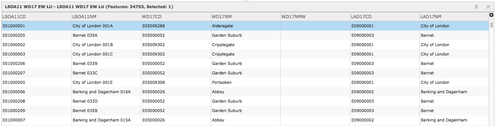
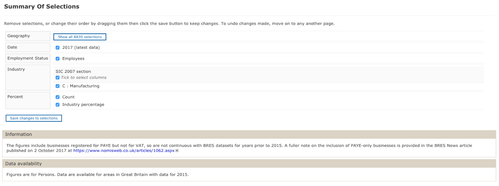

<style>
  h1, h2, h3, h4, h5, h6{
    color: #668e81;
    font-family: "arial narrow", helvetica;
  }
  h1, h2{
    font-size: 150%
  }
  h2{
    font-variant: small-caps
  }
</style>

```{r setup, include=FALSE}
knitr::opts_chunk$set(echo = TRUE)
```

# Nomis data analysis

***
Ref URLs:  

https://www.nomisweb.co.uk/  
https://data.london.gov.uk/dataset/lsoa-atlas  
http://geoportal.statistics.gov.uk/datasets/lower-layer-super-output-area-2011-to-ward-2017-lookup-in-england-and-wales  

***

## download data

*Data downloads > Query > Business Register and Employment Survey : open access*  

*"An employer survey of the number of jobs held by employees broken down by full/part-time and detailed industry (5 digit SIC2007). The survey records a job at the location of an employees workplace. Available from country down to lower level super output area and Scottish datazone."*  

Lower Layer Super Output Area (2011) to Ward (2017) Lookup in England and Wales.  
LSOA 2011 provide higher spatial resolution than ward.  

```{r, out.width = "1000px", echo=FALSE}

```

Summary of data query from Nomis website.  

GLA has 4835 LSOA (2011)  

```{r, out.width = "1000px", echo=FALSE}

```

## map prepared by omnis website

Map built by Nomis website (data output)

```{r, out.width = "1000px", echo=FALSE}
knitr::include_graphics("map_nomis.png")
```

*Is this what we want?*  

The boundaries of the LSOA areas:  

**- are too irregular that can even cut a street segment in many parts**  

**- overlap with streets segments so generate the problem of defining where to assign the centrality measures. MAUP**

These are the Live-links for data downloads.  

GLA_Manufacturing_perc_LSOA  

https://www.nomisweb.co.uk/livelinks/14448.xlsx  