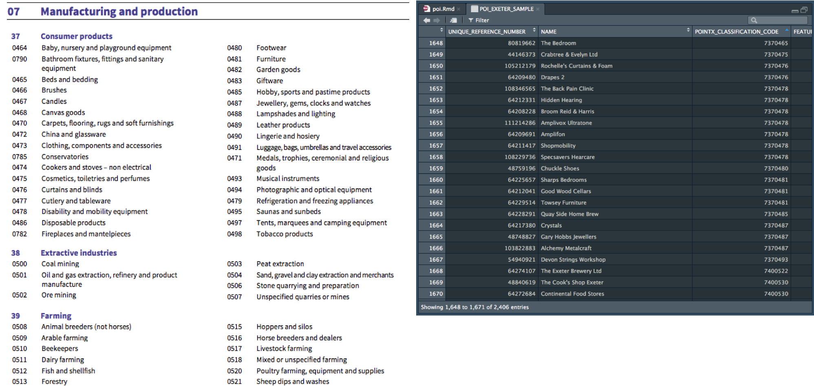

<style>
  h1, h2, h3, h4, h5, h6{
    color: #668e81;
    font-family: "arial narrow", helvetica;
  }
  h1, h2{
    font-size: 150%
  }
  h2{
    font-variant: small-caps
  }
</style>

```{r setup, include=FALSE}
knitr::opts_chunk$set(echo = TRUE)
```

# Q&D analysis of POI data from Ordnance Survey

POI dataset presentation: https://www.ordnancesurvey.co.uk/business-and-government/products/points-of-interest.html  
Classification Scheme: https://www.ordnancesurvey.co.uk/docs/product-schemas/points-of-interest-classification-scheme.pdf  
Reference: http://spatialreference.org/  

## read and prepare dataset

The dataset contains a variable with the classification of each point in a code with three levels, group, category and class. The code is built like this: *G(group),CC(category),CCCC(class)*

```{r, message=FALSE, warning=FALSE}
library(readr)
library(data.table)
PES <- read_csv("/Volumes/ritd-ag-project-rd00lq-jamfe87/GIS_Analysis/dataRaw/POI_EXETER_SAMPLE.csv")

# Calculate frequency of values for column [3] POINTX_CLASSIFICATION_CODE
Ccode <- PES[,3] # subset column POINTX_CLASSIFICATION_CODE
Ccode <- sapply(Ccode, function(x) table(factor(x, levels=unique(unlist(Ccode)), ordered=TRUE)))
# Convert to dataframe
Ccode <- as.data.frame(Ccode)
# convert rownames into variable 
Ccode <- setDT(Ccode, keep.rownames = TRUE)[]
# Sort descending
Ccode[order(-Ccode$POINTX_CLASSIFICATION_CODE) , ]
```

```{r, out.width = "1000px", echo=FALSE}

```


## quick map the data

```{r}
class(PES)
```

```{r, message=FALSE, warning=FALSE}
PES <- as.data.frame(PES)
library(tmap)
library(spData)
library(tmaptools)
library(sf)
library(sp)
### Get coordinates from your data.frame. 
EN <- PES[,c("FEATURE_EASTING","FEATURE_NORTHING")] # x,y -> Easting, Northing
# Convert dataframe to SP with CRS British National Grid
PESsp <- SpatialPointsDataFrame(coords = EN, data = PES,
                                proj4string = CRS("+proj=tmerc +lat_0=49 +lon_0=-2 +k=0.9996012717 +x_0=400000 +y_0=-100000 +ellps=airy +datum=OSGB36 +units=m +no_defs"))
tmap_mode("plot")
qtm(PESsp) # N=2406 obs.
```

## interactive map

```{r, message=FALSE, warning=FALSE}
# Transfrom SP object datum from datum=OSGB36 to WGS84
PESspWGS84 <-spTransform(PESsp, CRS("+proj=longlat +ellps=WGS84 +datum=WGS84 +no_defs"))

tmap_mode("view")
qtm(PESsp)
```

## map by group classification

```{r, message=FALSE, warning=FALSE}
library(dplyr)
# convert the SP object into an SF object...
PESsf <- st_as_sf(PESspWGS84)
# Group - Category - Class
# 07 Manufacturing and Production - 09 Retail
# Create variable 'group' from variable 'POINTX...' substract chr 1 (first character)
PESsf <- mutate(PESsf, group = substr(POINTX_CLASSIFICATION_CODE, 1, 1))

tmap_mode("view")
tm_shape(PESsf) + 
  tm_symbols(size=0.02,
             shape = 20,
             col = "group", 
             alpha = .6,
             border.lwd = NA,
             popup.vars = c("NAME", "group", "STREET_NAME" ,"ADDRESS_DETAIL")
  )

```

