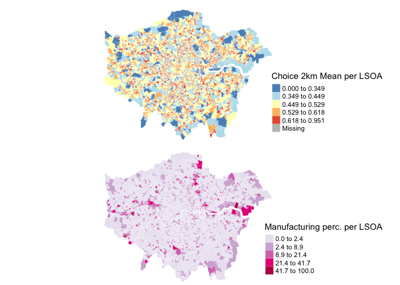

```{r setup, include=FALSE}
knitr::opts_chunk$set(echo = TRUE)
```

# openmapping SS - lsoa maps
```{r, out.width = "1000px", echo=FALSE}
knitr::include_graphics("syntax_md_files/figure-markdown_github/unnamed-chunk-12-1.png")
```


```{r, out.width = "1000px", echo=FALSE}
knitr::include_graphics("syntax_md_files/figure-markdown_github/unnamed-chunk-14-1.png")
```

```{r, out.width = "1000px", echo=FALSE}

```