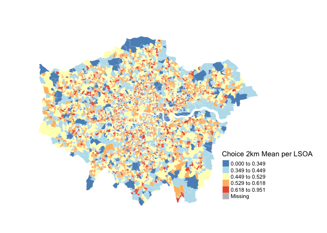
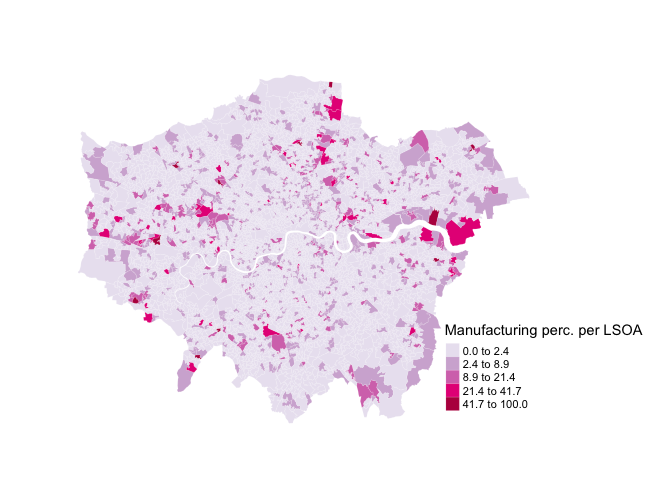
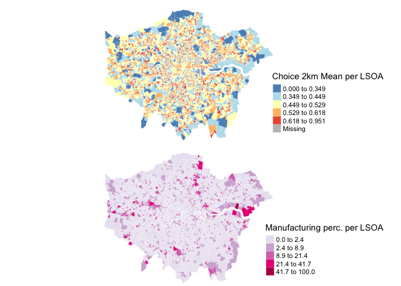

```{r setup, include=FALSE}
knitr::opts_chunk$set(echo = TRUE)
```

# openmapping SS - lsoa maps
```{r, out.width = "1000px", echo=FALSE}

```


```{r, out.width = "1000px", echo=FALSE}

```

```{r, out.width = "1000px", echo=FALSE}

```