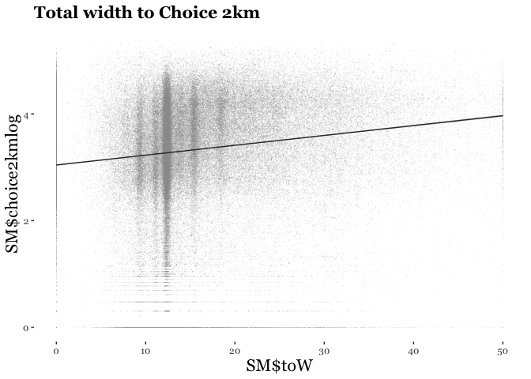

Street Metrics Corelations
================

Street Space Allocation Measures / Centrality
---------------------------------------------

*libraries*

``` r
library(tmap)
library(tmaptools)
library(ggplot2)
```

Read dataset joined in /Volumes/ucfnnap/R/Rprojects/syntax.R

``` r
library(readr)
joinssx <- read_csv("/Volumes/ucfnnap/R/Rprojects/ssyntax/joinssx.csv")
```

Names of variables

``` r
nam <- names(joinssx)
nam
```

    ##  [1] "lad15cd"              "lad15nm"              "lad15nmw"            
    ##  [4] "objectid"             "st_lengthshape"       "st_areashape"        
    ##  [7] "id"                   "metres"               "meridian_id"         
    ## [10] "meridian_gid"         "meridian_code"        "meridian_osodr"      
    ## [13] "meridian_number"      "meridian_road_name"   "meridian_indicator"  
    ## [16] "meridian_class"       "choice2km"            "choice2kmrank"       
    ## [19] "choice2kmlog"         "nodecount2km"         "integration2km"      
    ## [22] "integration2kmrank"   "choice10km"           "choice10kmrank"      
    ## [25] "choice10kmlog"        "nodecount10km"        "integration10km"     
    ## [28] "integration10kmrank"  "choice100km"          "choice100kmlog"      
    ## [31] "nodecount100km"       "integration100km"     "oa11cd"              
    ## [34] "wz11cd"               "lsoa11cd"             "lsoa11nm"            
    ## [37] "msoa11cd"             "msoa11nm"             "lad11cd"             
    ## [40] "lad11nm"              "meridian_class_scale" "OBJECTID"            
    ## [43] "DISTNAME"             "ROADNUMBER"           "CLASSIFICA"          
    ## [46] "NAME"                 "Leng"                 "head"                
    ## [49] "foW"                  "caW"                  "toW"                 
    ## [52] "caP"                  "foP"                  "x"                   
    ## [55] "y"                    "geometry"

Summary

``` r
summary(joinssx)
```

    ##    lad15cd            lad15nm            lad15nmw            objectid    
    ##  Length:195492      Length:195492      Length:195492      Min.   :294.0  
    ##  Class :character   Class :character   Class :character   1st Qu.:301.0  
    ##  Mode  :character   Mode  :character   Mode  :character   Median :309.0  
    ##                                                           Mean   :309.6  
    ##                                                           3rd Qu.:318.0  
    ##                                                           Max.   :326.0  
    ##                                                                          
    ##  st_lengthshape   st_areashape             id              metres        
    ##  Min.   : 8929   Min.   :  2897649   Min.   :  12120   Min.   :   1.069  
    ##  1st Qu.:33260   1st Qu.: 29601369   1st Qu.: 292430   1st Qu.:  58.249  
    ##  Median :40177   Median : 47305863   Median : 456025   Median :  95.525  
    ##  Mean   :42749   Mean   : 56064707   Mean   : 885636   Mean   : 121.695  
    ##  3rd Qu.:49776   3rd Qu.: 82171330   3rd Qu.:1790954   3rd Qu.: 158.597  
    ##  Max.   :74641   Max.   :150125298   Max.   :2038281   Max.   :1615.835  
    ##                                                                          
    ##   meridian_id       meridian_gid    meridian_code  meridian_osodr    
    ##  Min.   : 375905   Min.   :  3358   Min.   :3000   Length:195492     
    ##  1st Qu.: 613190   1st Qu.:883453   1st Qu.:3004   Class :character  
    ##  Median : 883791   Median :921946   Median :3004   Mode  :character  
    ##  Mean   : 824044   Mean   :741126   Mean   :3003                     
    ##  3rd Qu.: 964632   3rd Qu.:951300   3rd Qu.:3004                     
    ##  Max.   :1188286   Max.   :990880   Max.   :3004                     
    ##                                                                      
    ##  meridian_number    meridian_road_name meridian_indicator
    ##  Length:195492      Length:195492      Length:195492     
    ##  Class :character   Class :character   Class :character  
    ##  Mode  :character   Mode  :character   Mode  :character  
    ##                                                          
    ##                                                          
    ##                                                          
    ##                                                          
    ##  meridian_class       choice2km        choice2kmrank     choice2kmlog  
    ##  Length:195492      Min.   :     0.0   Min.   :0.0000   Min.   :0.000  
    ##  Class :character   1st Qu.:   830.4   1st Qu.:0.2711   1st Qu.:2.920  
    ##  Mode  :character   Median :  3367.0   Median :0.5248   Median :3.527  
    ##                     Mean   :  9806.2   Mean   :0.5147   Mean   :3.347  
    ##                     3rd Qu.: 11658.1   3rd Qu.:0.7638   3rd Qu.:4.067  
    ##                     Max.   :259147.2   Max.   :0.9997   Max.   :5.414  
    ##                                                                        
    ##   nodecount2km    integration2km   integration2kmrank   choice10km      
    ##  Min.   :   6.0   Min.   :  5.87   Min.   :0.0000     Min.   :       0  
    ##  1st Qu.: 396.0   1st Qu.:100.20   1st Qu.:0.2820     1st Qu.:   20651  
    ##  Median : 551.0   Median :144.04   Median :0.5150     Median :   98302  
    ##  Mean   : 627.1   Mean   :162.31   Mean   :0.5111     Mean   : 1238678  
    ##  3rd Qu.: 766.0   3rd Qu.:201.38   3rd Qu.:0.7441     3rd Qu.:  688748  
    ##  Max.   :2172.0   Max.   :695.61   Max.   :0.9997     Max.   :45672164  
    ##                                                                         
    ##  choice10kmrank   choice10kmlog   nodecount10km   integration10km 
    ##  Min.   :0.0000   Min.   :0.000   Min.   : 1589   Min.   : 113.8  
    ##  1st Qu.:0.2805   1st Qu.:4.315   1st Qu.: 9906   1st Qu.:1092.5  
    ##  Median :0.5322   Median :4.993   Median :13656   Median :1475.1  
    ##  Mean   :0.5232   Mean   :4.838   Mean   :14970   Mean   :1586.0  
    ##  3rd Qu.:0.7829   3rd Qu.:5.838   3rd Qu.:19550   3rd Qu.:2009.0  
    ##  Max.   :1.0000   Max.   :7.660   Max.   :30975   Max.   :3672.4  
    ##                                                                   
    ##  integration10kmrank  choice100km        choice100kmlog   nodecount100km  
    ##  Min.   :0.0004968   Min.   :0.000e+00   Min.   : 0.000   Min.   :284341  
    ##  1st Qu.:0.3501892   1st Qu.:5.064e+05   1st Qu.: 5.704   1st Qu.:319189  
    ##  Median :0.4806421   Median :2.134e+06   Median : 6.329   Median :328340  
    ##  Mean   :0.5001794   Mean   :1.349e+08   Mean   : 6.081   Mean   :331013  
    ##  3rd Qu.:0.6311013   3rd Qu.:1.433e+07   3rd Qu.: 7.156   3rd Qu.:344112  
    ##  Max.   :0.9999787   Max.   :1.002e+10   Max.   :10.001   Max.   :366495  
    ##                                                                           
    ##  integration100km    oa11cd             wz11cd            lsoa11cd        
    ##  Min.   : 7779    Length:195492      Length:195492      Length:195492     
    ##  1st Qu.:11131    Class :character   Class :character   Class :character  
    ##  Median :11841    Mode  :character   Mode  :character   Mode  :character  
    ##  Mean   :11805                                                            
    ##  3rd Qu.:12540                                                            
    ##  Max.   :15724                                                            
    ##                                                                           
    ##    lsoa11nm           msoa11cd           msoa11nm        
    ##  Length:195492      Length:195492      Length:195492     
    ##  Class :character   Class :character   Class :character  
    ##  Mode  :character   Mode  :character   Mode  :character  
    ##                                                          
    ##                                                          
    ##                                                          
    ##                                                          
    ##    lad11cd            lad11nm          meridian_class_scale
    ##  Length:195492      Length:195492      Min.   :1.000       
    ##  Class :character   Class :character   1st Qu.:1.000       
    ##  Mode  :character   Mode  :character   Median :1.000       
    ##                                        Mean   :1.428       
    ##                                        3rd Qu.:1.000       
    ##                                        Max.   :4.000       
    ##                                                            
    ##     OBJECTID        DISTNAME          ROADNUMBER         CLASSIFICA       
    ##  Min.   :     1   Length:195492      Length:195492      Length:195492     
    ##  1st Qu.: 51946   Class :character   Class :character   Class :character  
    ##  Median :103997   Mode  :character   Mode  :character   Mode  :character  
    ##  Mean   :104820                                                           
    ##  3rd Qu.:157831                                                           
    ##  Max.   :210759                                                           
    ##  NA's   :24513                                                            
    ##      NAME                Leng              head            foW        
    ##  Length:195492      Min.   :   0.05   Min.   :  0.0   Min.   : 0.000  
    ##  Class :character   1st Qu.:  46.71   1st Qu.:231.7   1st Qu.: 4.464  
    ##  Mode  :character   Median :  85.53   Median :270.9   Median : 5.797  
    ##                     Mean   : 126.14   Mean   :272.0   Mean   : 8.155  
    ##                     3rd Qu.: 158.83   3rd Qu.:320.0   3rd Qu.:10.028  
    ##                     Max.   :3537.26   Max.   :360.0   Max.   :50.000  
    ##                     NA's   :24513     NA's   :24513   NA's   :24513   
    ##       caW              toW             caP             foP       
    ##  Min.   : 0.000   Min.   : 0.00   Min.   : 0.00   Min.   : 0.00  
    ##  1st Qu.: 5.727   1st Qu.:11.85   1st Qu.:40.13   1st Qu.:36.60  
    ##  Median : 7.395   Median :13.31   Median :55.40   Median :42.98  
    ##  Mean   : 7.731   Mean   :15.87   Mean   :49.93   Mean   :46.18  
    ##  3rd Qu.: 9.094   3rd Qu.:19.14   3rd Qu.:62.23   3rd Qu.:56.74  
    ##  Max.   :49.701   Max.   :50.00   Max.   :99.86   Max.   :99.98  
    ##  NA's   :24513    NA's   :24513   NA's   :24513   NA's   :24513  
    ##        x               y           geometry        
    ##  Min.   :-0.51   Min.   :51.29   Length:195492     
    ##  1st Qu.:-0.23   1st Qu.:51.45   Class :character  
    ##  Median :-0.12   Median :51.51   Mode  :character  
    ##  Mean   :-0.12   Mean   :51.50                     
    ##  3rd Qu.:-0.01   3rd Qu.:51.56                     
    ##  Max.   : 0.32   Max.   :51.68                     
    ##  NA's   :61348   NA's   :61348

Delete missing values from relevant variables

``` r
nas <- c("Leng", "head", "foW", "caW", "toW", "caP", "foP", "choice2kmrank", "choice2kmlog")
SM <- na.omit(joinssx[,nas])
summary(SM)
```

    ##       Leng              head            foW              caW        
    ##  Min.   :   0.05   Min.   :  0.0   Min.   : 0.000   Min.   : 0.000  
    ##  1st Qu.:  46.71   1st Qu.:231.7   1st Qu.: 4.464   1st Qu.: 5.728  
    ##  Median :  85.53   Median :270.9   Median : 5.797   Median : 7.395  
    ##  Mean   : 126.14   Mean   :272.0   Mean   : 8.155   Mean   : 7.731  
    ##  3rd Qu.: 158.83   3rd Qu.:320.0   3rd Qu.:10.028   3rd Qu.: 9.094  
    ##  Max.   :3537.26   Max.   :360.0   Max.   :50.000   Max.   :49.701  
    ##       toW             caP             foP        choice2kmrank   
    ##  Min.   : 0.00   Min.   : 0.00   Min.   : 0.00   Min.   :0.0000  
    ##  1st Qu.:11.85   1st Qu.:40.13   1st Qu.:36.60   1st Qu.:0.2671  
    ##  Median :13.31   Median :55.40   Median :42.98   Median :0.5191  
    ##  Mean   :15.86   Mean   :49.93   Mean   :46.18   Mean   :0.5108  
    ##  3rd Qu.:19.14   3rd Qu.:62.23   3rd Qu.:56.74   3rd Qu.:0.7592  
    ##  Max.   :50.00   Max.   :99.86   Max.   :99.98   Max.   :0.9997  
    ##   choice2kmlog  
    ##  Min.   :0.000  
    ##  1st Qu.:2.905  
    ##  Median :3.512  
    ##  Mean   :3.335  
    ##  3rd Qu.:4.053  
    ##  Max.   :5.382

Quick map

``` r
class(SM)
```

    ## [1] "tbl_df"     "tbl"        "data.frame"

``` r
class(joinssx)
```

    ## [1] "tbl_df"     "tbl"        "data.frame"

``` r
#qtm(SM)
```

scatter plots
=============

``` r
c1 <- ggplot(SM, aes(SM$toW, SM$choice2kmlog)) +
  geom_point(alpha = 0.1, shape = ".", colour = "gray60") +
  #scale_x_log10("Total width", c(5, seq(10, 20, by=2), 20, 30, 40, 50)) +
  #scale_y_log10("Choice 2km", c(seq(5, 10, by=1), 20, 30, 40, 50)) +
  geom_smooth(method = "lm", size = 0.5, colour = "gray20") + # Smoothed conditional means "lm"= linear method
  ggtitle("Total width to Choice 2km") +
  theme_bw(base_family="Georgia") +
  theme(axis.text=element_text(size=9), axis.title=element_text(size=16), 
        plot.title = element_text(size = 16, face = "bold"),
        panel.grid.major = element_blank(),panel.grid.minor = element_blank(),
        panel.border = element_blank(),
        axis.line = element_blank())
c1
```



Regression analysis

``` r
regression <- lm(SM$choice2kmlog ~ SM$toW)
r2 <- summary(regression)$r.squared
r2
```

    ## [1] 0.0210764

``` r
regression
```

    ## 
    ## Call:
    ## lm(formula = SM$choice2kmlog ~ SM$toW)
    ## 
    ## Coefficients:
    ## (Intercept)       SM$toW  
    ##     3.04215      0.01849
